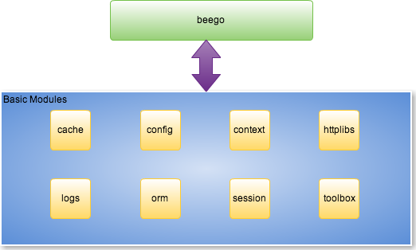
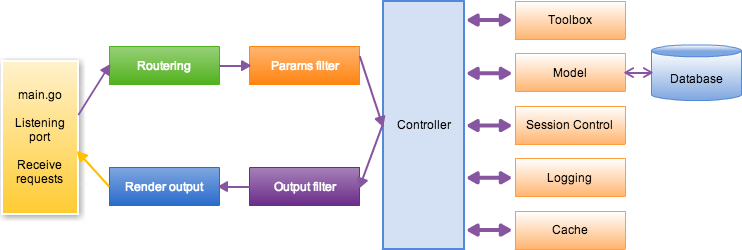

# What is Beego?

Beego is an HTTP framework for rapid development of Go applications. It can be used to develop APIs, web apps and backend services quickly. It is a RESTful framework.  It is inspired by Tornado, Sinatra and Flask and has integrated Go specific features such as interfaces and struct embedding.

## The architecture of Beego

Here is the architecture of Beego:



Beego is built upon 8 independent modules that are loosely coupled. Beego is designed for modular programming. You can still use any of these modules without using Beego's HTTP logic. For example, you can use `cache` module to handle your cache, `logs` module for logging and `config` module for processing files in many formats. So you can use all these modules not only in Beego but also in many other applications such as socket games. This is one of the reasons that Beego became popular. If you know Lego you should know all magnificent models are made of many small pieces. In the philosophy of Beego these modules are small building blocks and the magnificent model is Beego. We will talk more about these modules later.

## The execution logic of Beego

Beego is based on these modules so what's its execution logic? Beego is
a typical MVC architecture. Here is its execution logic:



## The project structure of Beego

Here is the typical folder structure of a Beego project:

```
├── conf
│   └── app.conf
├── controllers
│   ├── admin
│   └── default.go
├── main.go
├── models
│   └── models.go
├── static
│   ├── css
│   ├── ico
│   ├── img
│   └── js
└── views
    ├── admin
    └── index.tpl
```

We can see the M (models), V (views), C (controllers) folders. `main.go` is the entry point.

## Creating a Beego project

You can use the [bee tool to create a new project](../install/bee.md).
